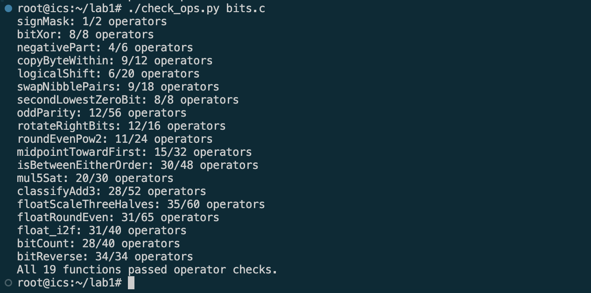
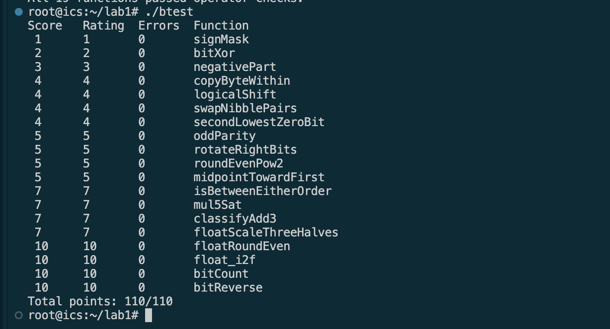

# Lab 1：Data Lab 实验报告


| 项目 | 内容 |
| --- | --- |
| 课程 | 计算机系统基础|
| 实验 | Lab 1：Data Lab |
| 姓名 | 钱彦文 |
| 学号 | 25301030033 |


## 一、实验目的

本实验通过在受限运算符和语法规则下实现位级函数，理解并应用，加深同学们对整数和浮点数二进制表示的认识，还能加深对位运算的理解，以及学到一些算法知识。


## 二、逐题设计与实现

### P1. `signMask`（1 分）

**实现思路：** 本题需要构造仅最高位为 1、其余位均为 0 的 32 位整数。由于最高位对应第 31 位，因此将整数 1 左移 31 位，即可得到所需的符号位掩码。实现仅使用一次左移运算，满足题目限制。

### P2. `bitXor`（2 分）

**实现思路：** 结果为1异或运算可以拆分为两种情况：x 为 1 且 y 为 0，或者 x 为 0 且 y 为 1。分别用 x & ~y 和 ~x & y 表示，再将两种情况合并即可。由于题目禁止使用按位或运算 |，根据德摩根定律 \(A \lor B=\neg(\neg A\land\neg B)\)，使用按位取反 ~ 和按位与 & 实现合并。

### P3. `negativePart`（3 分）

**实现思路：** 首先利用算术右移 `x >> 31` 获取符号掩码：当 `x` 为负数时得到全 1，否则得到全 0。随后根据补码性质，使用 `~x + 1` 构造 `x` 的相反数。最后将符号掩码与相反数进行按位与运算，使负数保留取反结果，非负数的结果被清零。

### P4. `copyByteWithin`（4 分）

**实现思路：** 首先利用 `src << 3` 和 `dst << 3` 计算源字节与目标字节的位偏移量。随后将整数右移对应位数，并通过 `& 0xFF` 提取源字节。接着使用 `0xFF << dstShift` 构造目标字节掩码，通过 `x & ~mask` 清空目标位置，同时保留其他字节。最后将提取出的源字节左移至目标位置，并与清空后的整数进行按位或运算，得到最终结果。

### P5. `logicalShift`（4 分）

**实现思路：** 由于负数进行算术右移时，高位会补充符号位 1，因此需要将这些多余的高位清零。首先使用 `1 << 31` 构造最高位为 1 的整数，再将其算术右移 `n` 位、左移 1 位并整体取反，得到高 `n` 位为 0、其余位为 1 的掩码。最后将 `x >> n` 的结果与该掩码进行按位与运算，即可消除符号位扩展，实现逻辑右移。

### P6. `swapNibblePairs`（4 分）

**实现思路：** 首先通过移位和按位或运算构造 `0x0F0F0F0F` 掩码，用于提取每个字节的低 4 位。随后使用 `(x & mask) << 4` 将原来的低 4 位移动到高 4 位，同时通过 `(x >> 4) & mask` 将原来的高 4 位移动到低 4 位。最后将两部分进行按位或运算，得到交换后的结果。

### P7. `secondLowestZeroBit`（4 分）

**实现思路：** 本题通过按位取反，将寻找第二个最低位的 0 转化为寻找第二个最低位的 1。首先使用 `~x` 得到取反后的整数，再利用补码性质，通过 `y & (~y + 1)` 提取最低位的 1。随后使用异或运算将该位清零，保留其他位不变。最后对剩余整数再次执行相同的最低位提取操作，即可得到第二个最低位的 1 所对应的掩码，也就是原整数第二个最低位的 0 所在的位置。当不足两个 0 时，结果自然为 0，无需额外进行条件判断。

### P8. `oddParity`（5 分）

**实现思路：** 由于多个二进制位连续异或的结果在 1 的个数为奇数时为 1、偶数时为 0，因此无需逐位计数。具体实现中，依次将整数右移 16、8、4、2、1 位，并与原值进行异或，使全部 32 位的奇偶性信息逐步汇总到最低位。最后使用 `x & 1` 提取该位，再通过逻辑非运算取反，使 1 的个数为偶数时返回 1、奇数时返回 0，从而实现题目要求的奇校验。

### P9. `rotateRightBits`（5 分）

**实现思路：** 首先使用 `n & 31` 计算实际旋转位数，保证移位量在合法范围内。随后对整数进行算术右移，并构造高位清零的掩码，将其转换为逻辑右移结果。对于右移过程中移出的低位部分，利用补码运算计算对应的左移位数，将这些位移动到整数最高位。最后通过按位或运算合并两部分，得到循环右移结果。

### P10. `roundEvenPow2`（5 分）

**实现思路：** 本题通过添加舍入偏置量，实现非负整数向最近的 \(2^n\) 倍数舍入，并在恰好位于中点时选择商为偶数的结果。首先使用 `1 << (n + ~0)` 计算半个舍入单位，并通过 `x >> n` 得到向下取整的商 `q`。随后根据 `q` 的奇偶性调整偏置量：当 `q` 为偶数时，偏置量为 \(2^{n-1}-1\)，使中点向下舍入；当 `q` 为奇数时，偏置量为 \(2^{n-1}\)，使中点向上舍入。最后对 `x + bias` 先右移 `n` 位再左移 `n` 位，得到符合就近舍入、中点取偶数规则的结果。

### P11. `midpointTowardFirst`（5 分）

**实现思路：** 首先利用恒等式 `x + y = 2 * (x & y) + (x ^ y)`，通过 `(x & y) + ((x ^ y) >> 1)` 计算中点向下取整的结果，避免直接相加造成溢出。随后利用 `x ^ y` 的最低位判断中点是否为半整数。对于需要舍入的情况，通过比较两个参数的符号，并在符号相同时检查差值符号，安全判断 `x > y`。最后仅在中点为半整数且 `x > y` 时将结果加 1，从而实现向第一个参数靠近的舍入规则。

### P12. `isBetweenEitherOrder`（7 分）

**实现思路：** 首先分别构造 `x-a` 和 `x-b`，并根据操作数的符号判断减法是否可能溢出。当两个数符号不同时，直接利用 `x` 的符号判断大小；符号相同时，则根据差值的符号位判断，从而得到 `x<a` 和 `x<b` 的结果。若两个比较结果不同，说明 `x` 位于两个端点之间。最后利用异或与逻辑非运算补充 `x` 等于任一端点的情况，实现不依赖端点顺序的闭区间判断。

### P13. `mul5Sat`（7 分）

**实现思路：** 首先将 `5x` 分解为 `(x << 2) + x`。由于左移和加法都可能产生溢出，因此分别进行检测：通过比较 `x` 与 `(x << 2) >> 2` 判断左移是否丢失有效位；在左移未溢出的情况下，通过比较原数与最终乘积的符号判断加法是否溢出。随后将两种溢出标志合并，构造全 0 或全 1 的选择掩码。同时根据原数的符号构造 `INT_MAX` 或 `INT_MIN`，最后利用按位与和按位或运算，在正常乘积与饱和值之间进行选择，实现不使用条件判断的饱和乘法。

### P14. `classifyAdd3`（7 分）

**实现思路：** 本题通过检测两次加法的溢出方向，判断三个有符号整数的精确数学和是否超出 32 位整数范围。首先依次计算 `s = x + y` 和 `t = s + z`，并提取各操作数及中间结果的符号位。利用两个非负数相加得到负数表示正溢出、两个负数相加得到非负数表示负溢出的性质，分别检测两次加法的溢出情况。由于第一次溢出后，第二次可能发生相反方向的溢出并相互抵消，因此分别记录正、负溢出标志，最后计算二者之差。结果为 1 表示正溢出，-1 表示负溢出，0 表示精确数学和仍处于有符号整数范围内。

### P15. `floatScaleThreeHalves`（7 分）

**实现思路：** 本题通过 IEEE 754 单精度浮点数的位级表示，实现浮点数乘以 3/2 的运算。首先提取符号位、指数和尾数字段，对 NaN 和无穷大直接返回原始位模式，并根据指数是否为零区分规格化数与非规格化数，恢复有效数字。随后将有效数字乘以 3，根据结果是否需要规格化确定右移位数，并相应调整指数。舍入时保留被移除的低位，根据其与中点的大小关系以及结果最低位的奇偶性，实现就近舍入、中点取偶数。最后处理非规格化数转为规格化数、尾数进位及指数溢出等情况，重新组合符号位、指数和尾数，得到最终结果。

### P16. `floatRoundEven`（10 分）

**实现思路：** 本题通过直接操作 IEEE 754 单精度浮点数的位表示，实现向最近整数舍入，并在中点情况下选择偶数。首先提取符号位、指数和尾数，根据实际指数划分不同情况：对于 NaN 和无穷大直接返回；对于绝对值小于 0.5 的数返回带有原符号的零；对于绝对值处于 0.5 到 1 之间的数单独判断；对于没有小数部分的数直接返回。其余情况下，根据实际指数计算尾数中小数部分的位数，利用掩码清除小数位，并比较被舍弃部分与半个舍入单位的大小。当被舍弃部分大于一半，或恰好等于一半且整数部分为奇数时，对保留部分进行进位。最后返回舍入后的浮点数位表示，从而实现就近舍入、中点取偶数的规则。

### P17. `float_i2f`（10 分）

**实现思路：** 首先根据输入整数的符号构造符号位，并使用无符号整数保存其绝对值，以正确处理 `INT_MIN`。随后通过循环右移确定最高有效位的位置，从而计算浮点数的实际指数。根据有效位数是否超过 24 位，分别采用左移补齐或右移截断的方式构造有效数字。对于需要截断的情况，提取被舍弃的低位，并按照就近舍入、中点取偶数的规则调整有效数字。如果舍入产生进位，则进一步右移有效数字并增加指数。最后将符号位、加上偏置值 127 的指数以及 23 位尾数重新组合，得到对应的单精度浮点数位表示。

### P18. `bitCount`（10 分）

**实现思路：** 本题统计 32 位整数中值为 1 的二进制位数量。首先通过移位和按位或运算构造 `0x55555555`、`0x33333333` 和 `0x0F0F0F0F` 三组掩码。随后利用掩码、移位和加法，依次将相邻的 1 位、2 位、4 位分组合并，使每个分组保存对应原始二进制位中 1 的数量。接着通过右移 8 位和 16 位进行累加，得到整个整数的统计结果。最后使用 `0x3F` 掩码提取最低 6 位，返回 1 的总数。

### P19. `bitReverse`（10 分）

**实现思路：** 首先构造用于交换相邻 1 位、2 位、4 位、8 位和 16 位分组的掩码，并通过异或和移位运算递推生成各级掩码，以减少运算符数量。随后依次利用左右移位、按位与和按位或运算，交换相邻的二进制位及不同大小的分组，使每个分组内部的位序逐步反转。经过五轮交换后，整个 32 位整数的二进制位顺序完全颠倒。


## 三、测试结果与验证

### 4.1 运算符与操作数合法性检查

执行命令：

```bash
./check_ops.py bits.c
```

**实际结果：** All 19 functions passed operator checks.

**截图：** 



### 4.2 功能正确性测试

执行命令：

```bash
./btest
```

**实际得分：** `110/110`

**截图：** 




## 四、实验总结

本次 DataLab 实验，我对计算机系统中的数据表示和底层运算机制有了更深入的理解。在整数部分的实验中，我进一步掌握了补码表示、位运算、掩码构造、移位操作以及溢出检测等知识，认识到许多高级语言中的简单操作在底层实现中需要结合二进制表示进行分析。

在浮点数相关实验中，我学习了 IEEE 754 单精度浮点数的表示方式，理解了符号位、指数位、尾数位以及舍入规则在实际计算中的作用。通过直接操作数据的位表示，我体会到了计算机处理数值时需要考虑精度、边界情况和特殊值等问题。

本实验也提高了我的问题分析和调试能力。面对运算符限制和复杂边界条件时，需要先理解数据在底层的变化规律，再设计合理的位运算方案。后续学习中，我希望将这种从底层理解计算机运行机制的思维应用到算法、人工智能等方向的学习中，进一步提升对计算机系统的整体认识。


